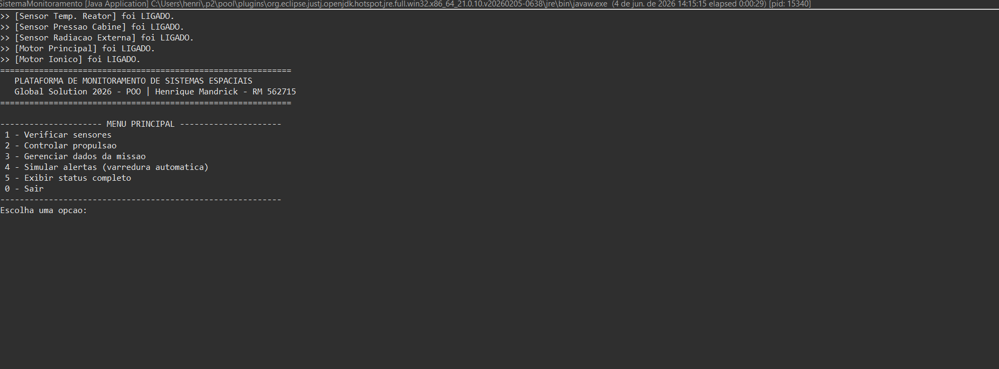
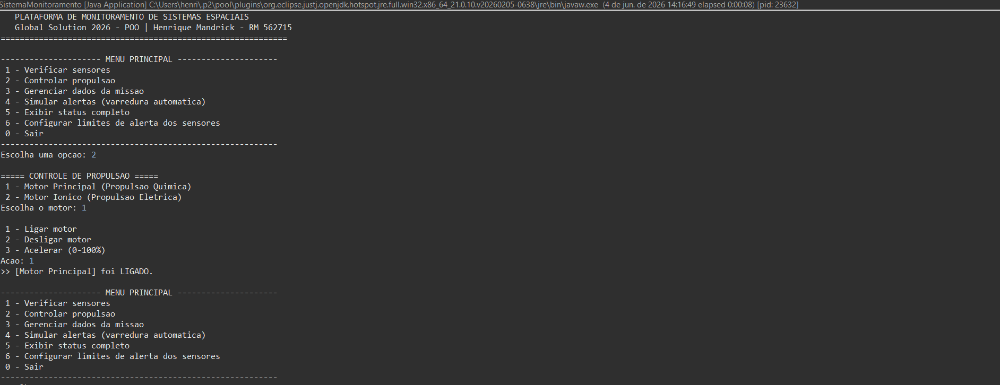
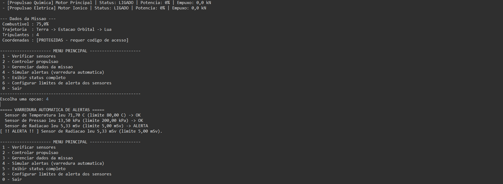

# Global Solution 2026 - POO | Plataforma de Monitoramento de Sistemas Espaciais

**Entrega:** INDIVIDUAL
**Aluno:** Henrique Mandrick — RM 562715

---

## O que é o projeto

Uma **plataforma de monitoramento de uma estação espacial**, feita em Java puro
(aplicação de console), criada para demonstrar os quatro pilares de Programação
Orientada a Objetos. A ideia é simular o painel de controle de uma estação: você
acompanha sensores, controla os motores, gerencia os dados da missão e o sistema
**detecta automaticamente situações de risco e emite alertas**.

## O que ele faz

- **Sensores** (temperatura, pressão e radiação): geram leituras simuladas
  (valores aleatórios), possuem limite de alerta e detectam quando o valor
  passa do limite.
- **Propulsão** (química e elétrica): ligar/desligar motores, acelerar de 0 a
  100% (com validação), e cálculo do empuxo gerado — cada tipo de motor se
  comporta de forma diferente.
- **Dados da missão**: coordenadas protegidas por código de acesso, nível de
  combustível com validação e alerta automático quando fica abaixo de 20%,
  trajetória e número de tripulantes.
- **Sistema de alertas**: varredura automática que classifica os problemas em
  três níveis — **ATENÇÃO**, **ALERTA** e **CRÍTICO** — e mostra na tela cada
  leitura avaliada, deixando claro o porquê de cada alerta.
- **Limites configuráveis**: dá para alterar o limite de alerta de cada sensor
  em tempo de execução pelo menu.
- **Menu interativo** em texto, com loop principal, para acessar tudo isso.

> Não há interface gráfica (não é necessária) e os valores dos sensores são
> simulados, conforme permitido pelo enunciado.

## 📸 Demonstração

**1. Inicialização e menu principal** — todos os componentes são ligados e o
menu interativo é exibido:



**2. Controle de propulsão** — seleção de motor e acionamento (ligar/desligar/
acelerar), com a opção de configurar limites já disponível no menu:



**3. Status completo + varredura automática de alertas** — o sistema mostra o
relatório de todos os componentes e, na varredura, exibe **cada leitura com seu
nível** (note o `ALERTA` no sensor de radiação acima do limite):



## Onde está o `main` / onde testar

O arquivo principal é **`SistemaMonitoramento.java`** — é nele que está o método
`main` e o menu. **Execute esse arquivo para testar todo o sistema.**

### Como compilar e rodar (terminal)

A partir da pasta `Entrega/`:

```bash
javac *.java
java SistemaMonitoramento
```

### Como rodar em uma IDE (Eclipse, IntelliJ, VS Code, NetBeans, BlueJ)

1. Importe/abra a pasta `Entrega` como projeto Java.
2. Localize a classe **`SistemaMonitoramento`**.
3. Clique em **Run** (ela contém o `main`).

### Roteiro rápido de teste

1. Opção **5** — ver o status completo de toda a estação.
2. Opção **1** — gerar novas leituras dos sensores.
3. Opção **2** — ligar um motor e acelerar (tente um valor inválido, ex.: 150,
   para ver a validação).
4. Opção **3** — ver as coordenadas usando o código de acesso **`1234`** (tente
   um código errado para ver o "ACESSO NEGADO"); reduza o combustível para
   abaixo de 20% e veja o alerta automático.
5. Opção **4** — rodar a varredura automática de alertas (mostra cada leitura).
6. Opção **6** — alterar o limite de um sensor (ex.: baixe o limite de radiação
   para 1 e rode a varredura de novo para forçar alertas).
7. Opção **0** — sair.

## Estrutura e conceitos de POO

| Arquivo | Conceito demonstrado |
|---------|----------------------|
| `ComponenteEspacial.java` | **Classe abstrata** (base de todos os componentes; método abstrato `gerarRelatorio()`) |
| `Sensor.java` | **Interface** (contrato dos sensores; inclui método `default`) |
| `SensorTemperatura.java` | Herança + **Interface** (`extends` + `implements`) |
| `SensorPressao.java` | Herança + **Interface** |
| `SensorRadiacao.java` | Herança + **Interface** |
| `DadosMissao.java` | **Encapsulamento** (atributos privados, getters/setters com validação, senha) |
| `SistemaPropulsao.java` | **Herança** (classe abstrata base dos motores) |
| `PropulsaoQuimica.java` | Herança + `super()` + sobrescrita de `acelerar()` |
| `PropulsaoEletrica.java` | Herança + `super()` + sobrescrita de `acelerar()` |
| `SistemaMonitoramento.java` | Classe **principal**: `main`, menu, loop e motor de alertas |

### Como tudo se conecta

Todos os componentes (sensores **e** motores) herdam de `ComponenteEspacial`.
Isso permite que o sistema os guarde em uma única lista e chame
`gerarRelatorio()` de forma polimórfica — cada um responde do seu jeito. Os
sensores, além de serem componentes, também cumprem o contrato `Sensor`, o que o
sistema usa para ler valores e detectar limites. É essa unificação que torna a
plataforma coesa em vez de ser quatro exercícios isolados.

> **Requisitos:** Java 8 ou superior (usa apenas a biblioteca padrão).
